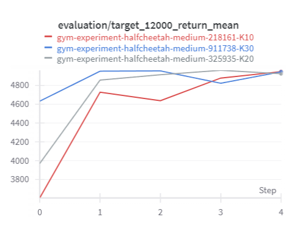
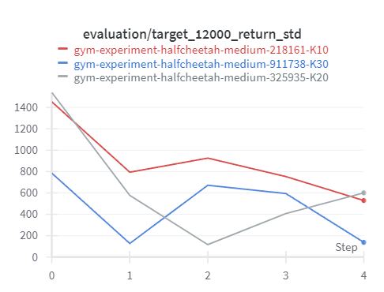

# Reinforcement Learning via. Sequence Modeling using Decision Transformer

## Introduction
This repository contains experiments to reproduce some of the results of the paper [Decision Transformer: Reinforcement Learning via Sequence Modeling (Chen et al.)](https://arxiv.org/abs/2106.01345) and [Online Decision Transformer (Zheng et al.)](https://arxiv.org/abs/2202.05607) and study the effect of context length on the variances of the expected returns of the Decision Transformer model in OpenAI Gym environments and Atari games. For more details, check out this [report](report.pdf) / [slides](slides.pptx).

</img> </img> 

## Running Experiments
- Run the notebook file `HuggingFaceDecisionTransformer.ipynb` and follow the instructions in the file to experiment with the pre-trained models using HuggingFace models.  

- Run the notebook file `decision_transformer_gym.ipynb` and follow the instructions in the file. Note that Google Drive has been linked to the notebook for data and output storage. This notebook file is used to run Decision Transformer training on OpenAI Gym environments.

- Run the notebook file `decision_transformer_atari.ipynb` and follow the instructions in the file. Note that Google Drive has been linked to the notebook for data and output storage. This notebook file is used to run Decision Transformer training on on Atari games.

- Run the notebook file `online_dt.ipynb` and follow the instructions in the file. Note that Google Drive has been linked to the notebook for data and output storage. This notebook file is used to run Online Decision Transformer training on both OpenAI Gym environments and Atari games.

## Contributing

Pull requests are welcome. For major changes, please open an issue first to discuss what you would like to change.

## License

[Apache License 2.0](https://choosealicense.com/licenses/apache-2.0/)
